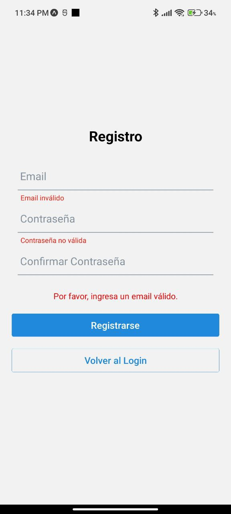
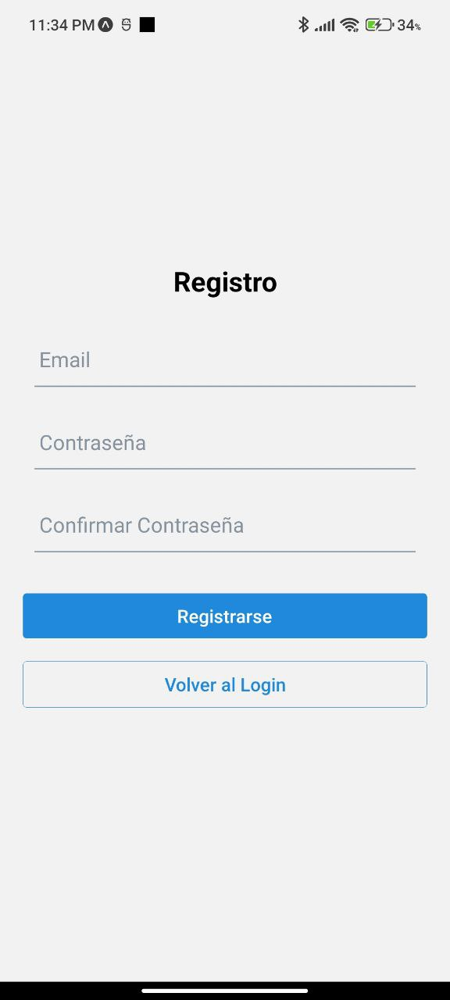
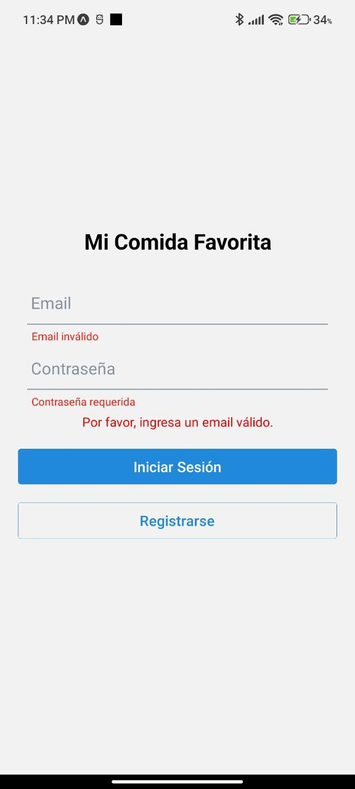
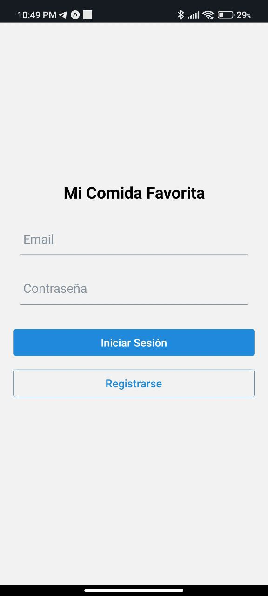

# MiComidaFavoritaTarea2
# Requisitos:
las siguientes herramientas instaladas:

    Node.js (versión 14 o superior)
    npm o yarn
    Expo CLI
    Un emulador de Android/iOS o un dispositivo físico
    Cuenta activa en Firebase Console
Instalación y configuración

1. Instalar dependencias

-  npm install

-  npm install @react-navigation/native @react-navigation/native-stack

-  npm install firebase

-  npm install react-native-elements

-  npm install expo-constants

-  npm install react-native-safe-area-contex

2. Configurar Firebase

    Ir a Firebase Console ( https://console.firebase.google.com/)
    Crear nuevo proyecto "MiComidaFavorita"
    Habilitar Authentication (Email/Password)
    Crear Cloud Firestore
    Registrar la aplicación web
    Copiar configuración de Firebase

3. Iniciar el proyecto

- npx expo start

4. link video demostracion
- https://drive.google.com/file/d/1k-o5kjnWUT9xwDxvxnUm9lrgbioqI5eq/view?usp=drive_link 
